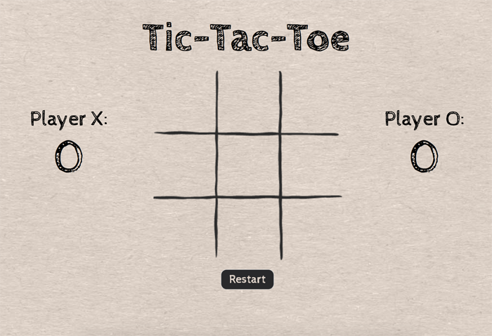

# Tic Tac Toe

[Live Demo](https://stevenkulp.github.io/TicTacToe/)

## Overview:

To start, the players are presented with a blank Tic Tac Toe board. Player X's total score is displayed to the left of the board, and Player O's score is displayed to the right of the board. A "Restart" button also displays below the board.

If the game ends in a stalemate, a message will appear at the bottom of the screen indicating the game is a draw. Neither player's score will change.

If Player X places three "X" symbols in a row on the board, the game will stop. A message will appear at the bottom of the screen declaring Player X the winner, and Player X's total score will increase by one.

If Player O places three "O" symbols in a row on the board, the game will stop. A message will appear at the bottom of the screen declaring Player O the winner, and Player O's total score will increase by one. 

